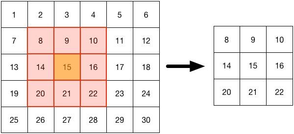
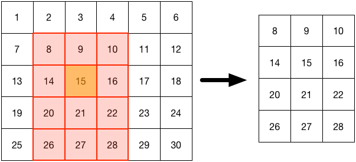
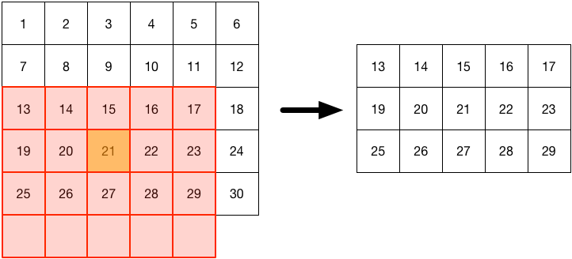
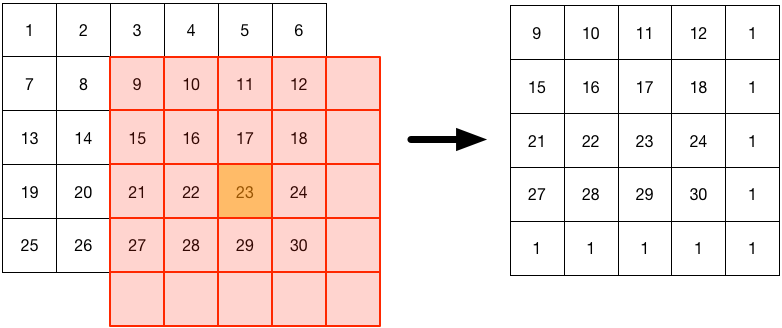

# Homework 04 Bonus

## Starting the environment

Before you start, don't forget to enable your conda environment using

    source activate scientific

on Unix-based systems, or

    activate scientific

on Windows. If you named your environment differently, you can figure out its
name by running the command

    conda info --envs

After you activated your environment, make sure to install all requirements of
this current week by changing to your project-folder and running

    pip install -r requirements.txt

## Your tasks

For this week's bonus task you will do a exercise which will require
you to understand shape and slice-access of numpy arrays.

Your task is to create a function `subarray` that will return a
sub-array of a given array. You can specify the shape of the new sub-array (how
many rows and columns) and the point it is centered on. If the sub-array
overlaps with the boundary of the original array, a fill-value can be provided,
otherwise the overlap should be omitted. The function signature should be as
follows:

    import numpy as np

    def sub_array(array, shape, center, fill=None):
        # ... your code here

You can assume, that the input `array` is a numpy-array with arbitrary
values. The `shape` parameter will be a tuple with `(rows, cols)`,
the `center` will be a tuple with the coordinates `(row, col)`
and `fill` is defaulted to `None`, but can be assigned to
any value that should be used for filling overlap. The function should return
the appropriate sub-array as a numpy-array. Here you can see a couple of
illustrations of the function's behavior:

Example 1: Input-array has shape (5, 6). Sub-array-center (orange)
is (2, 2), sub-array (red) has shape (3, 3). The result is a 3x3 sub-patch.

Example 2: Input-array has shape (5, 6). Sub-array-center (orange)
is (2, 2), sub-array (red) has shape (4, 3). The result is a 4x3 sub-patch.
Note the location of the center for even number of rows or columns.

Example 3: Input-array has shape (5, 6). Sub-array-center (orange)
is (3, 2), sub-array (red) has shape (4, 5). Here **`fill=None`**. The result is a 3x5 sub-patch.

Example 4: Input-array has shape (5, 6). Sub-array-center (orange)
is (3, 4), sub-array (red) has shape (5, 5). Here **`fill=1`**. The result is a 5x5 sub-patch.

> Good luck!
